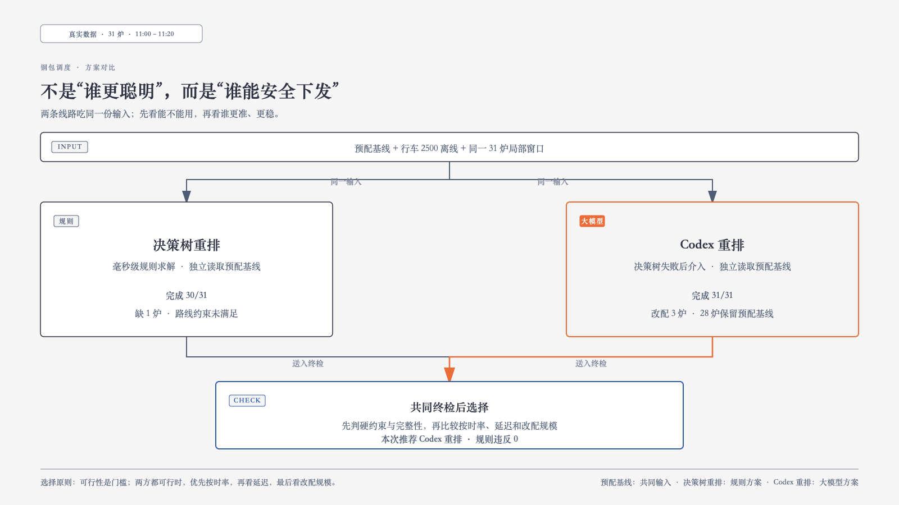
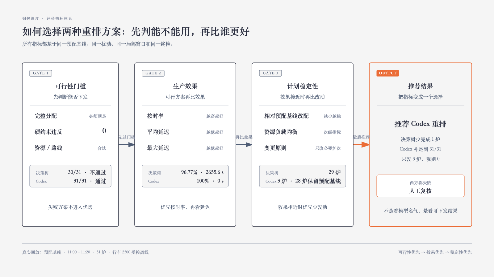

# 钢包重排包评价体系建立

**日期：** 2026-08-31  
**分支：** `feature-1.0`  
**数据：** 真实 `PLAN(1).xlsx`、`CRANE.xlsx`、`loc_location.xlsx`

## 1. 汇报结论

在真实 11:00–11:20 局部窗口的 31 炉压力回放中，行车 2500 离线后，决策树重排方案完成 30/31；Codex 重排方案完成 31/31。Codex 只改配 3 炉，28 炉保留预配基线，硬约束终检通过、规则违反 0。

本次推荐：**Codex 重排方案**。原因：决策树重排方案完成 30/31、规则违反 1；Codex 重排方案完成 31/31、规则违反 0。 Codex 的作用是决策树失败后的补位，不替代全量预配包，也不绕过终检。

## 2. 系统怎么起作用

1. 生产开始前，决策树生成预配基线。
2. 11:00 发生扰动，只打开 11:00–11:20 的 31 炉窗口；已完成和远期炉次不动。
3. 先生成决策树重排方案；如果局部方案不完整，Codex 基于预配基线、事故状态、可用资源和约束独立生成 Codex 重排方案。
4. Codex 重排方案先过完整性、资源和路线约束终检，检查通过后才形成可下发方案。

预配基线是两条线路的唯一共同输入，决策树重排方案与 Codex 重排方案独立生成；Codex 不读取决策树输出。本次使用离线预先保存并重新校验的 Codex 审计方案，未调用外部接口（`external_api_called=false`）。

### 2.1 评价指标体系

评价不是把所有指标简单相加，而是分三层判定：第一层决定方案能不能安全下发；第二层比较生产效果；第三层在效果接近时比较计划稳定性。任何方案只要第一层失败，就不能因为改动少而被推荐。

### 一、安全可行性门槛

| 指标 | 含义 | 计算方式 | 判定方向 | 决策树重排 | Codex 重排 |
| --- | --- | --- | --- | --- | --- |
| 完整分配 | 窗口内每炉都有钢包和行车 | 已分配炉次 ÷ 窗口炉次 | 必须等于 100% | 30/31，不通过 | 31/31，通过 |
| 硬约束违反 | 检查钢包、行车、时间、位置、路线、负载和安全距离 | 所有违规项计数 | 必须等于 0 | 1，不通过 | 0，通过 |
| 资源与路线合法性 | 分配的钢包、行车和运输路线必须在当前快照中可用 | 逐炉校验资源存在且路线可达 | 任一违规即不可下发 | 存在未满足项 | 全部满足 |

### 二、生产效果

| 指标 | 含义 | 计算方式 | 判定方向 | 决策树重排 | Codex 重排 |
| --- | --- | --- | --- | --- | --- |
| 按时率 | 在炉次时间窗结束前完成运输的比例 | 按时炉次 ÷ 窗口炉次 | 越高越好 | 96.77% | 100.00% |
| 平均延迟 | 每炉超出时间窗的延迟，未超时按 0 计 | 平均值：max(到达时刻 − 时间窗结束, 0) | 越低越好 | 2655.6 秒 | 0.0 秒 |
| 最大延迟 | 窗口内最晚一炉的超时程度 | max(每炉延迟) | 越低越好 | 82325 秒 | 0 秒 |

### 三、计划稳定性

| 指标 | 含义 | 计算方式 | 判定方向 | 决策树重排 | Codex 重排 |
| --- | --- | --- | --- | --- | --- |
| 相对预配基线改配炉次数 | 重排方案相对生产前预配基线改变钢包或行车的炉次数 | 逐炉比较钢包编号和行车编号 | 效果接近时越少越好 | 29 炉 | 3 炉；28 炉保留预配基线 |
| 资源负载均衡 | 比较各行车最终负载的离散程度 | 各行车最终负载的方差 | 效果接近时越低越好 | 次级指标，当前审计未单独汇总 | 次级指标，当前审计未单独汇总 |
| 变更范围 | 扰动只影响当前局部窗口，不扩散到已完成和远期炉次 | 统计窗口外是否发生改配 | 必须保持局部 | 局部窗口内重排 | 局部窗口内重排 |

**本次如何落到选择：** 决策树重排方案只完成 30/31，并有 1 项规则违反，因此在第一层即淘汰；Codex 重排方案完成 31/31，规则违反 0，进入生产效果和计划稳定性比较，最终推荐 Codex 重排方案。

## 3. 真实实验结果

| 指标 | 结果 |
| --- | ---: |
| PLAN 总行数 / 纳入评测 | 469 / 457 炉 |
| 预配基线 | 457/457，规则违反 0 |
| 真实资源 | 34 个钢包、10 台行车 |
| 扰动窗口 | 11:00–11:20，共 31 炉 |
| 决策树重排方案 | 30/31 |
| Codex 重排方案 | 31/31 |
| Codex 改配 / 保留预配基线 | 3 炉 / 28 炉 |
| Codex 硬约束终检 | 31/31 通过，规则违反 0 |
| 最终推荐 | Codex 重排方案 |
| 推荐原因 | 决策树重排方案完成 30/31、规则违反 1；Codex 重排方案完成 31/31、规则违反 0。 |

### 3.1 Codex 实际改配

| 炉次 | 原钢包 / 行车 | Codex 重排钢包 / 行车 |
| --- | --- | --- |
| DT0142D1-300759 | ST36 / 2500 | ST15 / 2520 |
| DT0143D8-300767 | ST36 / 2500 | ST27 / 1170 |
| DT0164D1-300776 | ST36 / 2500 | ST36 / 4170 |

## 4. 相比“失败后呼叫人工”的价值

决策树负责毫秒级常规重排；Codex 只处理决策树无法完成的困难窗口。在仍有时间预算时，它可以快速补足资源组合，并输出可审计的局部方案，避免直接退回人工。此次回放中，决策树重排方案少完成 1 炉，Codex 重排方案补足到 31/31，且只改变 3 炉。

离线场景库共 21 条，其中 20 条是“决策树失败、Codex 成功”的压力场景，覆盖行车、通道、钢包、工艺设施、计划节奏、数据状态和复合扰动。

## 5. 边界与下一步

行车 2500 离线是基于真实 PLAN/CRANE 快照构造的可复现压力输入，不是宝钢历史事故日志。当前结果验证的是离线回放中的调度输入、方案生成和硬约束闭环，不替代现场 PLC、安全联锁、人工审批或线上 API 延迟验收。

下一步接入实时事件流、现场路线与设备联锁约束，并在沙箱环境测量真实 API 的端到端耗时。

## 6. 证据

- 真实文件：`/Users/admin/Desktop/数据文件/PLAN(1).xlsx`、`CRANE.xlsx`、`loc_location.xlsx`
- 主压力场景审计：`outputs/real_data_codex_stress_demo/audit.json`
- 离线场景库：`outputs/offline_scenarios/ladle_scenarios.sqlite3`
- Excel 对比结果：`outputs/PLAN(1)_位置映射决策树预配包结果.xlsx`
